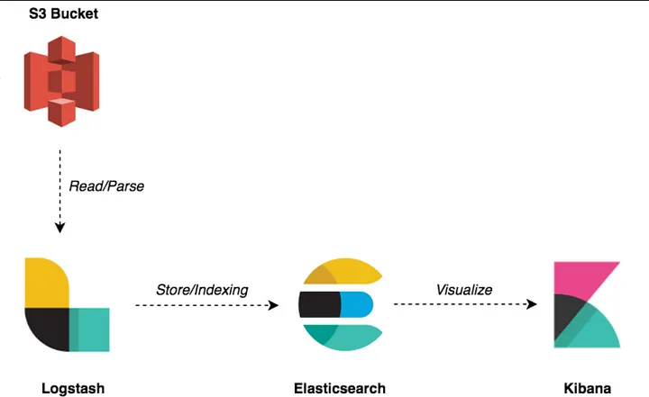
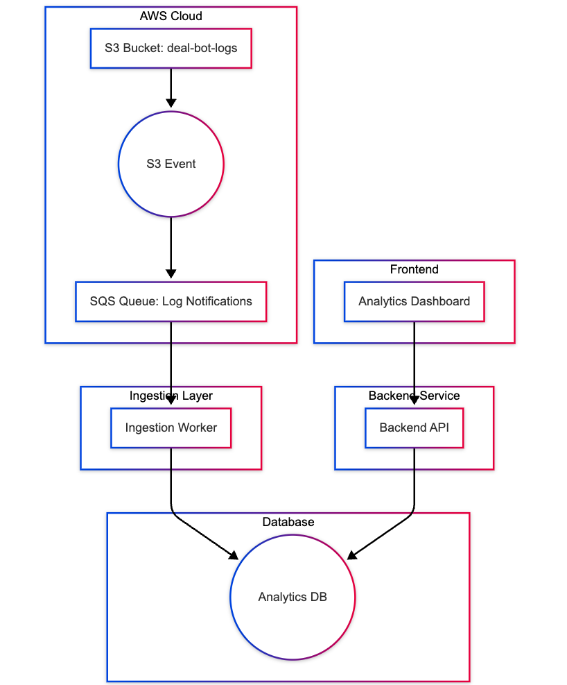

# Deal Bot Analytics System

## Overview
This system provides analytics and monitoring capabilities for the Deal Bot, a ChatGPT-style feature in the Cur8 Capital app that helps investors query deal information. The system processes interaction logs, stores them efficiently, and provides insights through a user-friendly interface.

My intial thoughts when drafting the design doc for this porblem is the below


## System Requirements

### Functional Requirements
1. **Data Ingestion**
   - Read structured logs from S3 bucket
   - Parse logs efficiently using batching/streaming
   - Store data in an analytics-optimized database
   - Provide single-command ingestion pipeline

Log format
```

{
    "level": 30,
    "time": 1743532441581,
    "timestamp": "2025-04-01T18:34:01.581Z",
    "pid": 46,
    "hostname": "75915b60-c2beffba-b9de-4b",
    "req": {
      "id": 3558,
      "method": "GET",
      "url": "/deals",
      "query": {},
      "headers": {
        "x-forwarded-for": "184.182.215.20",
        "x-forwarded-proto": "https",
        "x-forwarded-port": "443",
        "host": "cur8-api.pub.islamicfinanceguru.dev",
        "x-amzn-trace-id": "Root=1-36ec6b44-66b2bbac-c4fd-41e3b063b5",
        "user-agent": "Cur8Mobile/2.2.9 (iOS 16.4)",
        "cookie": "auth_user_id=1102; access_token=f1406962-e38c-4cbe-a5cf-a5b76707fe4d; refresh_token=7a9be37d-4640-4d4b-bfbb-326eb622afb5"
      },
      "remoteAddress": "::ffff:10.0.236.240",
      "remotePort": 19250
    },
    "context": "ApiController",
    "message": "Processing GET request for /deals",
    "authUserId": 1102
  }

```


2. **Backend API**
   - Query counts (daily/weekly)
   - Most common questions/topics
   - Failed/low-satisfaction queries
   - Average response time metrics
   - Pagination and caching support

3. **Frontend Interface**
   - Search and browse conversation logs
   - View usage trend metrics and charts
   - Analyze common questions and errors
   - User-friendly interface for non-technical users

### Non-Functional Requirements
1. **Performance**
   - Efficient data ingestion and processing
   - Fast query response times
   - Support for analytics at scale

2. **Usability**
   - Clear and intuitive interface
   - Easy setup and deployment
   - Minimal learning curve for non-technical users

3. **Maintainability**
   - TypeScript throughout the codebase
   - Clean, well-documented code
   - Comprehensive test coverage

## Proposed Solution

### Architecture Overview

### Technology Stack
1. Data Ingestion Service

Role: Reads JSON logs from S3 and writes them to a database.
	•	Language: Node.js (TypeScript)
	•	Tooling: AWS SDK (v3), streams & batching
	•	Features:
	•	Stream/batch read logs from S3
	•	Transform & validate data
	•	Bulk insert into database
	•	One-step CLI script (npm run ingest)

2. Database

Recommendation: PostgreSQL (via TimescaleDB or native indexes) for:
	•	Analytical queries (group by day/week)
	•	JSON column support for flexible schema
	•	Easy local setup with Docker

If scale demands more, ClickHouse could be a fast analytical DB — but PostgreSQL is safer for now and easier to set up/test locally or elastic search, needs a compairson based on our use cases..

3. Backend API

Role: Exposes analytics data.
	•	Framework: NestJS (TypeScript)
	•	API Type: REST (simple, cacheable)
	•	Endpoints:
	•	/metrics/daily-queries
	•	/metrics/top-questions
	•	/metrics/empty-results
	•	/metrics/average-response-time
	•	/logs?search=...&page=...

Why REST? well, there is no details about wither the app is going to be mobile or webapp, while graphql will gave us a space for better control over the returned content, and coming with apollo client support that will make a nice visibility for our APIs, hmmm, I might need to revist this just because of the nice visibility and better extendability...
For caching I believe queries related to the metrics should be cachable, however will need to think a bit about the evication policy and updating them...

4. Frontend
	•	Framework: Next.js (or React with Vite) => needs research on whatever theme that support most of these re
	•	Charting: Chart.js or Recharts
	•	Features:
	•	Search & filter logs
	•	View metrics via graphs
	•	Drill into topics/errors
	•	Simple dashboard layout


5. **Infrastructure**
   - Docker containers
   - Docker Compose for orchestration
   - Local development environment

### Database Schema


## Open Questions and Considerations

1. **Data Volume and Performance**
   - How to handle large log files efficiently?
   - What's the optimal batch size for ingestion?
   - How to implement efficient querying for analytics?
   - which DB to use timescale, ES, lighthouse?

2. **Scalability**
   - How to handle increasing data volume?
   - What's the best strategy for data retention?
   - How to implement efficient caching?

3. **User Experience**
   - What metrics are most valuable to non-technical users?
   - How to present complex data in an intuitive way?
   - What's the right balance between detail and simplicity?

## Implementation Plan

1. **Phase 1: Foundation**
   - Set up project structure
   - Implement basic data ingestion
   - Create database schema
   - Set up Docker environment

2. **Phase 2: Core Features**
   - Implement backend API
   - Create basic frontend interface
   - Add essential analytics
   - Implement search functionality

3. **Phase 3: Enhancement**
   - Add advanced visualizations
   - Implement caching
   - Optimize performance
   - Add comprehensive testing

## Getting Started

1. Clone the repository
2. Set up environment variables
3. Run `docker compose up`
4. Access the application at `http://localhost`


## Notes/ Future work
- The system is designed to run within a trusted boundary
- Authentication/authorization is not required
- Focus is on functionality and usability over visual design
- Performance optimization for current scale only 
- Assuming that the logs data is patched into sizable and fitable chunks into the ingestor's memory, so processing them as patches make sense
- the script should have option to re run the ingestor on a specific folder aka date
- maybe later on we can integrate with alert manager