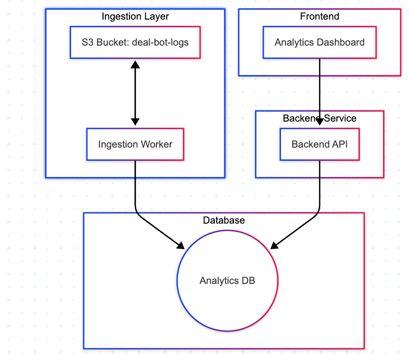

# Logs Analytics System

## Overview
This system provides analytics and monitoring capabilities over our logs, espcially logs related to our new gpt feature, a ChatGPT-style feature in the Cur8 Capital app that helps investors query deal information. The system processes interaction logs, stores them efficiently, and provides insights through a user-friendly interface.

My intial thoughts when drafting the design doc for this porblem is the below

## System Requirements

### Functional Requirements
For a detailed analysis of the functional requirements and implementation strategies, see [Functional Requirements Analysis](docs/FUNCTIONAL_REQ_ANALYSIS.md).

1. **Data Ingestion**
   - Read structured logs from S3 bucket
   - Parse logs efficiently using batching/streaming
   - Store data in an analytics-optimized database
   - Provide single-command ingestion pipeline

2. **Backend API**
   - Query counts (daily/weekly)
   - Most common questions/topics
   - Failed/low-satisfaction queries
   - Average response time metrics
   - Pagination and caching support

3. **Frontend Interface**
   - Search and browse conversation logs
   - View usage trend metrics and charts
   - Analyze common questions and errors
   - User-friendly interface for non-technical users

### Non-Functional Requirements
1. **Performance**
   - Efficient data ingestion and processing
   - Fast query response times
   - Support for analytics at scale

2. **Usability**
   - Clear and intuitive interface
   - Easy setup and deployment
   - Minimal learning curve for non-technical users

3. **Maintainability**
   - TypeScript throughout the codebase
   - Clean, well-documented code
   - Comprehensive test coverage

## Proposed Solution

### Architecture Overview

### IDEAL Arch  

### Current

The current architecture is as follows:
Replacing the AWS layer with postgresql table to track processed and new files.
The reason for that is to reduce the complexity of the system and to make it more easy to test and maintain.
### Project Structure
This project uses a monorepo structure to manage the backend, frontend, and ingestion service. For detailed information about the project structure and monorepo benefits, see [Project Structure](docs/PROJECT_STRUCTURE.md).

### API Design
The system uses GraphQL for its API, providing efficient data fetching and flexible querying capabilities. This choice enables:
- Efficient multi-query support
- Selective field fetching
- Complex filtering for log search
- Real-time updates via subscriptions

For a detailed comparison of API design choices and implementation considerations, see [API Comparison](docs/API_COMPARISON.md).

### Technology Stack
1. Data Ingestion Service
Role: Reads JSON logs from S3 and writes them to a database.
	-	Language: Node.js (TypeScript)
	-	Tooling: AWS SDK (v3), streams & batching
	-	Features:
	-	Stream/batch read logs from S3
	-	Transform & validate data
	-	Bulk insert into database
	-	One-step CLI script (npm run ingest)
    - Easy to run and test locally with files...
- Check the [ingestion service](backend/ingestor/README.md) for more details.
2. Database
Recommendation: PostgreSQL (via TimescaleDB or native indexes) for:
	-	Analytical queries (group by day/week)
	-	JSON column support for flexible schema
	-	Easy local setup with Docker
 - For a detailed comparison of different database options (TimescaleDB, ClickHouse, Elasticsearch, and MongoDB Time Series), see [Database Comparison](docs/DATABASE_COMPARISON.md).
If scale demands more, ClickHouse could be a fast analytical DB — but PostgreSQL is safer for now and easier to set up/test locally and will support searching as well as aggregation later on we could either spilt the searching from the aggregation or find a solution that supports both
3. Backend API
**API Design: GraphQL**
	-	Language: Node.js (TypeScript)
	-	Features:
      -	Query counts by day/week
      -	Common questions/topics
      -	Average response time metrics
- Check the [backend service](backend/api/README.md) for more details.
4. **Frontend**
	-	Framework: Next.js
	-	Charting: rechart
	-	Features:
	-	Search & filter logs [TBD]
	-	View metrics via graphs
	-	Drill into topics/errors [TBD]
	-	Simple dashboard layout
5. **Infrastructure**
   - Docker containers
   - Docker Compose for orchestration
   - Local development environment

### Database Schema
Check the [database schema](docs/SCHEMA_LOGS_ANALYSIS.md) for more details.

## Open Questions and Considerations

1. **Data Volume and Performance**
   - How to handle large log files efficiently?
        From the looks of it, I'm assuming that all files are short 50 logs statement max as it seems to be 1 minute patched, however our app could be popular someday and when that happen maybe we will adjust it to make sure that it's a small chunk that could be consumed by our workers
   - What's the optimal batch size for ingestion?
        I think around 100 logs statement would be enough
   - How to implement efficient querying for analytics?
        This needs somethinking....
        Well everytime we will add a new metrics it will require some sort of BE involvement to write the query for it...
        Maybe we can store it's sql query somewhere and restore it based on the user demand but for the time being I'll hard code it to earn time.

   - which DB to use timescale, ES, lighthouse?
        Since this is a prototype, I will go with postgress as it will support all features we need without complicatins, later on when the app scales we can move the searching to ES while aggregations to be done over timescale or other db

2. **Scalability**
   - How to handle increasing data volume?
        Message queues and S3 as well as retentions will do the trick
   - What's the best strategy for data retention?
        Maybe move old and processed files into a cold storage
   - How to implement efficient caching?
        Most likely the place that would need caching the most would be the metrics side aka the aggregations, should we use redis or in memory? for the time being will go with in memory to deliever this task fast, should we go with pre calc aggregations or cache on demand? well, the easiest and more convent would be in demand and if we notice that it takes to much time and it's important to fit certin SLO then we will go with the pre-calc.
3. Are we interested in all logs or we should just persist Deal related logs?
I assumed that we are interested in all logs, so that's what I did, however if we are not we can just adjust the ingestor logic to actualy ignore not related context logs.

## Implementation Plan

1. **Phase 1: Foundation**
   - Set up project structure
   - Implement basic data ingestion
   - Create database schema
   - Set up Docker environment

2. **Phase 2: Core Features**
   - Implement backend API
   - Create basic frontend interface
   - Add essential analytics

3. **Phase 3: Enhancement**
   - Implement caching
   - Optimize performance
   - Add comprehensive testing

## Getting Started

1. Clone the repository
2. Set up environment variables
3. Run `export AWS_ACCESS_KEY_ID='YOUR_AWS_ACCESS_KEY_ID' && export AWS_SECRET_ACCESS_KEY='YOUR_AWS_SECRET_ACCESS_KEY' && export AWS_REGION="us-east-1" && export AWS_S3_BUCKET="dev.deal-bot-logs" && docker-compose up`
4. Access the application at `http://localhost:3000`

## Notes/ Future work
- Fix the FE initial loading issue
- handle records with no time stamp to pull it from the file/folder instead of setting the now file/ also handle record failure in a deadletter queue or something.
- Add health endpoints for better tracking of the app health
- Assuming that the logs data is patched into sizable and fitable chunks into the ingestor's memory, so processing them as patches make sense
- the script should have option to re run the ingestor on a specific folder aka date
- maybe later on we can integrate with the alert manager
- Add lint rules to prevent common issues such as console.log usage
- Add unit tests for our use case integeration test would be better as there is no service logic
- Using the cache manager in memory or redis to cache the metrics data most of it doesn't change very fre, escpially if we showed data that's today - 1 till 7 days back.

####
[Project demo](https://www.loom.com/share/55f7c40c0d8848ed8a7cbe98e12a45f4?sid=b5524a62-8863-40b0-817b-b9afd5b560b0)
